# The 'compnet' workflow

``` r
library(compnet)
```

## Introduction

The goal of a ‘compnet’ analysis is to quantify the effect of
competitive niche differentiation on community assembly for a group of
species. Competitive niche differentiation is a process whereby
functional dissimilarity between species promotes co-occurrence through
decreased overlap in resource use. Our input data will include a
species-by-site presence-absence matrix, as well as one or more
species-level variables (e.g., plant rooting depth) and/or variables
that only pertain to pairs of species (e.g., phylogenetic distance).

Before using ‘compnet’, we’ll translate our conceptual goal into a
quantitative “estimand” (i.e., something we’re aiming to estimate with
our model). When we use the default probability distribution for the
response variable, Fisher’s noncentral hypergeometric distribution, our
estimand will be the effect of functional dissimilarity between two
species (as quantified via one or more traits; see above) on
“co-occurrence affinity” [Mainali et
al. 2022](https://kyle-rosenblad.github.io/compnet/articles/10.1126/sciadv.abj9204),
a measure of species’ propensity to co-occur more or less than expected
given their individual occurrence frequencies.

Alternatively, we can use the binomial probability distribution for the
response variable, with the “successes” representing sites where both
species co-occur, and the “trials” representing sites where at least one
occurs. We are modeling the effects of our predictors on the
logit-transformed probability of success.

To estimate the effect of functional dissimilarity on co-occurrence, we
will use a regression model, in which the units of analysis are species
pairs. The response variable is co-occurrence affinity (or co-occurrence
probability if we switch to a binomial response variable). We can
include as many predictors as we want. We’ll take advantage of this fact
later, when we adjust for a suspected confounding variable.

Using species pairs as units of analysis can cause problems for typical
regression models, and ‘compnet’ has tools for dealing with these
problems. When we build a regression model (e.g., a linear regression,
GLM, GLMM, etc.), we usually assume that the errors are independently
distributed. This assumption will likely be violated if we model species
pairs in a network without taking special steps. One problem is that all
pairs that include a given species might share features in common. All
‘compnet’ models include components designed to account for this kind of
pattern. Additionally, there can be higher-order patterns of
non-independence among species pairs–e.g., “the enemy of my enemy is my
friend”. ‘compnet’ also has optional model features for dealing with
these higher-order patterns, which we will demonstrate below. Further
technical details are discussed in \[PREPRINT LINK COMING SOON\].

Let’s get started!

## Data prep

``` r
set.seed(287) # Ensure reproducibility

# Load an example presence-absence matrix:
data("ex_presabs")

# View the first few rows and columns.
# Rows are sites, and columns are species.
# rownames and colnames are specified accordingly.
ex_presabs[1:3, 1:3]
#>       sp1 sp2 sp3
#> site1   0   0   0
#> site2   0   0   0
#> site3   0   0   1
```

``` r

# Load example species-level trait data:
data("ex_traits")

# View the first few species.
# Rows are species, and columns are traits.
# rownames and colnames are specified accordingly.
ex_traits[1:3,]
#>        ndtrait   domtrait ctrait
#> sp1 -0.9283953 -0.7888064      a
#> sp2 -0.1460273  0.3867546      c
#> sp3  0.7896740  1.6554773      a
```

## Model with one species trait

In the example data set, “ndtrait” is a trait that we think might drive
competitive niche differentiation (e.g., plant rooting depth), and
“domtrait” is a trait that we think might influence competitive ability
(e.g., plant height). “ctrait” is a categorical trait that we also
suspect of driving competitive niche differentiation. First we’ll build
a model with just “ndtrait”, as competitive niche differentiation is the
process we’re interested in.

If “ndtrait” is driving competitive niche differentiation, then we
expect species pairs who differ strongly in this trait to have greater
co-occurrence affinity. We’ll model the effect of “ndtrait” on
co-occurrence affinity using a “distance interaction” term. In other
words, for each species pair, our model will use species A’s value of
“ndtrait”, species B’s value, and the absolute value of the difference
between these two values. This last term directly captures the effect
we’re interested in, which is called “heterophily” in the social
sciences (i.e., things that are different being attracted to each
other). Social scientists often model heterophily using a multiplicative
interaction term instead of a distance term. Here we use a distance
interaction term because it captures certain features of the competitive
niche differentiation process that multiplicative interaction terms
can’t represent. (We’ll see an example later.) However, multiplicative
interaction terms can provide other advantages (which we’ll also note
below). To use a multiplicative interaction term, just use
‘spvars_multi_int’ instead of ‘spvars_dist_int’ in the example code.

Stan, the statistical software under the hood, uses a Hamiltonian Monte
Carlo (HMC) algorithm to estimate our results for us. If we don’t let
the HMC sampler run for enough iterations, we can’t trust our results.
Stan will tell us if we didn’t let our model run long enough, and it
will provide web links to help resources.

Before we try to build a good model, let’s deliberately tell Stan to do
a very small number of iterations so we can see what those warnings look
like:

``` r
shortrun <- buildcompnet(presabs=ex_presabs,
                  spvars_dist_int=ex_traits[c("ndtrait")],
                  warmup=100,
                  iter=200)
#> [1] "You are currently running a compnet model with a Fisher's noncentral hypergeometric likelihood. This is the default option because there is strong theory supporting it. However, choosing a binomial likelihood (i.e., setting family='binomial') instead may result in a substantially faster run. This alternative option performs equally well in simulation-based testing. See https://kyle-rosenblad.github.io/compnet/ for more details"
#> 
#> SAMPLING FOR MODEL 'srm_fnchypg' NOW (CHAIN 1).
#> Chain 1: 
#> Chain 1: Gradient evaluation took 0.000388 seconds
#> Chain 1: 1000 transitions using 10 leapfrog steps per transition would take 3.88 seconds.
#> Chain 1: Adjust your expectations accordingly!
#> Chain 1: 
#> Chain 1: 
#> Chain 1: WARNING: There aren't enough warmup iterations to fit the
#> Chain 1:          three stages of adaptation as currently configured.
#> Chain 1:          Reducing each adaptation stage to 15%/75%/10% of
#> Chain 1:          the given number of warmup iterations:
#> Chain 1:            init_buffer = 15
#> Chain 1:            adapt_window = 75
#> Chain 1:            term_buffer = 10
#> Chain 1: 
#> Chain 1: Iteration:   1 / 200 [  0%]  (Warmup)
#> Chain 1: Iteration:  20 / 200 [ 10%]  (Warmup)
#> Chain 1: Iteration:  40 / 200 [ 20%]  (Warmup)
#> Chain 1: Iteration:  60 / 200 [ 30%]  (Warmup)
#> Chain 1: Iteration:  80 / 200 [ 40%]  (Warmup)
#> Chain 1: Iteration: 100 / 200 [ 50%]  (Warmup)
#> Chain 1: Iteration: 101 / 200 [ 50%]  (Sampling)
#> Chain 1: Iteration: 120 / 200 [ 60%]  (Sampling)
#> Chain 1: Iteration: 140 / 200 [ 70%]  (Sampling)
#> Chain 1: Iteration: 160 / 200 [ 80%]  (Sampling)
#> Chain 1: Iteration: 180 / 200 [ 90%]  (Sampling)
#> Chain 1: Iteration: 200 / 200 [100%]  (Sampling)
#> Chain 1: 
#> Chain 1:  Elapsed Time: 3.665 seconds (Warm-up)
#> Chain 1:                2.212 seconds (Sampling)
#> Chain 1:                5.877 seconds (Total)
#> Chain 1:
#> Warning: The largest R-hat is 1.12, indicating chains have not mixed.
#> Running the chains for more iterations may help. See
#> https://mc-stan.org/misc/warnings.html#r-hat
#> Warning: Bulk Effective Samples Size (ESS) is too low, indicating posterior means and medians may be unreliable.
#> Running the chains for more iterations may help. See
#> https://mc-stan.org/misc/warnings.html#bulk-ess
#> Warning: Tail Effective Samples Size (ESS) is too low, indicating posterior variances and tail quantiles may be unreliable.
#> Running the chains for more iterations may help. See
#> https://mc-stan.org/misc/warnings.html#tail-ess
#> [1] "compnet uses Stan under the hood. You may see warnings from Stan alongside, \nthis message. To deal with any warnings Stan might issue, \nPlease see the links provided in Stan's output, as well as the compnet website:\nhttps://kyle-rosenblad.github.io/compnet/"
```

Now let’s build our first distance interaction model. We’ll call it
‘nd_0_mod’ because we’re using “ndtrait” as a predictor, and we’re using
the default ‘rank’ value of 0. (We’ll discuss the importance of this
rank = 0 decision shortly.) Sometimes, it takes a few tries at gradually
adjusting ‘warmup’ and ‘iter’ until you’re getting sufficient samples to
avoid warnings. I’ve already done that trial and error for this example
data set, so I’ll set ‘warmup’ and ‘iter’ at the sweet spot. (The
default settings will produce a longer run, but we don’t need that
here.)

``` r
nd_0_mod <- buildcompnet(presabs=ex_presabs,
        spvars_dist_int=ex_traits[c("ndtrait")],
        warmup=400,
        iter=1200)
#> [1] "You are currently running a compnet model with a Fisher's noncentral hypergeometric likelihood. This is the default option because there is strong theory supporting it. However, choosing a binomial likelihood (i.e., setting family='binomial') instead may result in a substantially faster run. This alternative option performs equally well in simulation-based testing. See https://kyle-rosenblad.github.io/compnet/ for more details"
#> 
#> SAMPLING FOR MODEL 'srm_fnchypg' NOW (CHAIN 1).
#> Chain 1: 
#> Chain 1: Gradient evaluation took 0.000362 seconds
#> Chain 1: 1000 transitions using 10 leapfrog steps per transition would take 3.62 seconds.
#> Chain 1: Adjust your expectations accordingly!
#> Chain 1: 
#> Chain 1: 
#> Chain 1: Iteration:    1 / 1200 [  0%]  (Warmup)
#> Chain 1: Iteration:  120 / 1200 [ 10%]  (Warmup)
#> Chain 1: Iteration:  240 / 1200 [ 20%]  (Warmup)
#> Chain 1: Iteration:  360 / 1200 [ 30%]  (Warmup)
#> Chain 1: Iteration:  401 / 1200 [ 33%]  (Sampling)
#> Chain 1: Iteration:  520 / 1200 [ 43%]  (Sampling)
#> Chain 1: Iteration:  640 / 1200 [ 53%]  (Sampling)
#> Chain 1: Iteration:  760 / 1200 [ 63%]  (Sampling)
#> Chain 1: Iteration:  880 / 1200 [ 73%]  (Sampling)
#> Chain 1: Iteration: 1000 / 1200 [ 83%]  (Sampling)
#> Chain 1: Iteration: 1120 / 1200 [ 93%]  (Sampling)
#> Chain 1: Iteration: 1200 / 1200 [100%]  (Sampling)
#> Chain 1: 
#> Chain 1:  Elapsed Time: 7.788 seconds (Warm-up)
#> Chain 1:                8.937 seconds (Sampling)
#> Chain 1:                16.725 seconds (Total)
#> Chain 1: 
#> [1] "compnet uses Stan under the hood. You may see warnings from Stan alongside, \nthis message. To deal with any warnings Stan might issue, \nPlease see the links provided in Stan's output, as well as the compnet website:\nhttps://kyle-rosenblad.github.io/compnet/"
```

Before we try to interpret any results, let’s see if this model provides
a reasonable fit to the data. One of our main concerns with network data
is the multiple forms of non-independence that can arise among
observations, as discussed in the Introduction. Let’s use the ‘gofstats’
function to check how well our model accounts for these types of
non-independence in the example data set:

``` r
nd_0_mod_gofstats <- gofstats(nd_0_mod)
#> Fitting base model for comparison with full model
#> SAMPLING FOR MODEL 'base_fnchypg' NOW (CHAIN 1).
#> 
#> SAMPLING FOR MODEL 'base_fnchypg' NOW (CHAIN 2).
#> Chain 1: 
#> Chain 1: Gradient evaluation took 0.000561 seconds
#> Chain 1: 1000 transitions using 10 leapfrog steps per transition would take 5.61 seconds.
#> Chain 1: Adjust your expectations accordingly!
#> Chain 1: 
#> Chain 1: 
#> Chain 2: 
#> Chain 2: Gradient evaluation took 0.000553 seconds
#> Chain 2: 1000 transitions using 10 leapfrog steps per transition would take 5.53 seconds.
#> Chain 2: Adjust your expectations accordingly!
#> Chain 2: 
#> Chain 2: 
#> Chain 1: Iteration:    1 / 2000 [  0%]  (Warmup)
#> Chain 2: Iteration:    1 / 2000 [  0%]  (Warmup)
#> Chain 1: Iteration:  200 / 2000 [ 10%]  (Warmup)
#> Chain 2: Iteration:  200 / 2000 [ 10%]  (Warmup)
#> Chain 1: Iteration:  400 / 2000 [ 20%]  (Warmup)
#> Chain 2: Iteration:  400 / 2000 [ 20%]  (Warmup)
#> Chain 1: Iteration:  600 / 2000 [ 30%]  (Warmup)
#> Chain 2: Iteration:  600 / 2000 [ 30%]  (Warmup)
#> Chain 1: Iteration:  800 / 2000 [ 40%]  (Warmup)
#> Chain 2: Iteration:  800 / 2000 [ 40%]  (Warmup)
#> Chain 1: Iteration: 1000 / 2000 [ 50%]  (Warmup)
#> Chain 1: Iteration: 1001 / 2000 [ 50%]  (Sampling)
#> Chain 2: Iteration: 1000 / 2000 [ 50%]  (Warmup)
#> Chain 2: Iteration: 1001 / 2000 [ 50%]  (Sampling)
#> Chain 1: Iteration: 1200 / 2000 [ 60%]  (Sampling)
#> Chain 2: Iteration: 1200 / 2000 [ 60%]  (Sampling)
#> Chain 1: Iteration: 1400 / 2000 [ 70%]  (Sampling)
#> Chain 2: Iteration: 1400 / 2000 [ 70%]  (Sampling)
#> Chain 1: Iteration: 1600 / 2000 [ 80%]  (Sampling)
#> Chain 2: Iteration: 1600 / 2000 [ 80%]  (Sampling)
#> Chain 1: Iteration: 1800 / 2000 [ 90%]  (Sampling)
#> Chain 2: Iteration: 1800 / 2000 [ 90%]  (Sampling)
#> Chain 1: Iteration: 2000 / 2000 [100%]  (Sampling)
#> Chain 1: 
#> Chain 1:  Elapsed Time: 6.857 seconds (Warm-up)
#> Chain 1:                4.547 seconds (Sampling)
#> Chain 1:                11.404 seconds (Total)
#> Chain 1: 
#> Chain 2: Iteration: 2000 / 2000 [100%]  (Sampling)
#> Chain 2: 
#> Chain 2:  Elapsed Time: 7.183 seconds (Warm-up)
#> Chain 2:                4.673 seconds (Sampling)
#> Chain 2:                11.856 seconds (Total)
#> Chain 2:
nd_0_mod_gofstats
#> p.sd.rowmeans   p.cycle.dep 
#>    0.05371111    0.76108889
```

The first ‘p-value’, ‘p.sd.rowmeans’, tells us about patterns driven by
the fact that all species pairs including a given species share features
in common. Our ‘p.sd.rowmeans’ is low, which means when we simulate data
from the model we’ve built (‘gofstats’ did this in the background), most
of the simulated data have at least as much of this kind of
non-independence than the real data. That means our model looks to be
doing a good job accounting for this form of non-independence among
species pairs. Anything that’s not super-high (around maybe 0.9ish or
more) is usually considered fine.

The second value, ‘p.cycle.dep’, tells us about higher-order
multi-species patterns. These can be abstract and challenging to
conceptualize. A good example is the saying, “the enemy of my enemy is
my friend”. Our ‘p.cycle.dep’ looks good as well.

As an exercise, let’s try increasing ‘rank’, which can be helpful when
our ‘gofstats’ aren’t looking good (even though we don’t have strong
motivation to do so in this case).

``` r
nd_1_mod <- buildcompnet(presabs=ex_presabs,
        spvars_dist_int=ex_traits[c("ndtrait")],
        rank=1,
        warmup=300,
        iter=1000)
#> [1] "You are currently running a compnet model with a Fisher's noncentral hypergeometric likelihood. This is the default option because there is strong theory supporting it. However, choosing a binomial likelihood (i.e., setting family='binomial') instead may result in a substantially faster run. This alternative option performs equally well in simulation-based testing. See https://kyle-rosenblad.github.io/compnet/ for more details"
#> 
#> SAMPLING FOR MODEL 'ame_fnchypg' NOW (CHAIN 1).
#> Chain 1: 
#> Chain 1: Gradient evaluation took 0.00065 seconds
#> Chain 1: 1000 transitions using 10 leapfrog steps per transition would take 6.5 seconds.
#> Chain 1: Adjust your expectations accordingly!
#> Chain 1: 
#> Chain 1: 
#> Chain 1: Iteration:   1 / 1000 [  0%]  (Warmup)
#> Chain 1: Iteration: 100 / 1000 [ 10%]  (Warmup)
#> Chain 1: Iteration: 200 / 1000 [ 20%]  (Warmup)
#> Chain 1: Iteration: 300 / 1000 [ 30%]  (Warmup)
#> Chain 1: Iteration: 301 / 1000 [ 30%]  (Sampling)
#> Chain 1: Iteration: 400 / 1000 [ 40%]  (Sampling)
#> Chain 1: Iteration: 500 / 1000 [ 50%]  (Sampling)
#> Chain 1: Iteration: 600 / 1000 [ 60%]  (Sampling)
#> Chain 1: Iteration: 700 / 1000 [ 70%]  (Sampling)
#> Chain 1: Iteration: 800 / 1000 [ 80%]  (Sampling)
#> Chain 1: Iteration: 900 / 1000 [ 90%]  (Sampling)
#> Chain 1: Iteration: 1000 / 1000 [100%]  (Sampling)
#> Chain 1: 
#> Chain 1:  Elapsed Time: 8.726 seconds (Warm-up)
#> Chain 1:                12.614 seconds (Sampling)
#> Chain 1:                21.34 seconds (Total)
#> Chain 1:
#> Warning: The largest R-hat is 1.05, indicating chains have not mixed.
#> Running the chains for more iterations may help. See
#> https://mc-stan.org/misc/warnings.html#r-hat
#> Warning: Bulk Effective Samples Size (ESS) is too low, indicating posterior means and medians may be unreliable.
#> Running the chains for more iterations may help. See
#> https://mc-stan.org/misc/warnings.html#bulk-ess
#> [1] "compnet uses Stan under the hood. You may see warnings from Stan alongside, \nthis message. To deal with any warnings Stan might issue, \nPlease see the links provided in Stan's output, as well as the compnet website:\nhttps://kyle-rosenblad.github.io/compnet/"
nd_1_mod_gofstats <- gofstats(nd_1_mod)
#> Fitting base model for comparison with full model
#> SAMPLING FOR MODEL 'base_fnchypg' NOW (CHAIN 1).
#> 
#> SAMPLING FOR MODEL 'base_fnchypg' NOW (CHAIN 2).
#> Chain 1: 
#> Chain 1: Gradient evaluation took 0.000583 seconds
#> Chain 1: 1000 transitions using 10 leapfrog steps per transition would take 5.83 seconds.
#> Chain 1: Adjust your expectations accordingly!
#> Chain 1: 
#> Chain 1: 
#> Chain 1: Iteration:    1 / 2000 [  0%]  (Warmup)
#> Chain 2: 
#> Chain 2: Gradient evaluation took 0.000544 seconds
#> Chain 2: 1000 transitions using 10 leapfrog steps per transition would take 5.44 seconds.
#> Chain 2: Adjust your expectations accordingly!
#> Chain 2: 
#> Chain 2: 
#> Chain 2: Iteration:    1 / 2000 [  0%]  (Warmup)
#> Chain 1: Iteration:  200 / 2000 [ 10%]  (Warmup)
#> Chain 2: Iteration:  200 / 2000 [ 10%]  (Warmup)
#> Chain 1: Iteration:  400 / 2000 [ 20%]  (Warmup)
#> Chain 2: Iteration:  400 / 2000 [ 20%]  (Warmup)
#> Chain 1: Iteration:  600 / 2000 [ 30%]  (Warmup)
#> Chain 2: Iteration:  600 / 2000 [ 30%]  (Warmup)
#> Chain 1: Iteration:  800 / 2000 [ 40%]  (Warmup)
#> Chain 2: Iteration:  800 / 2000 [ 40%]  (Warmup)
#> Chain 1: Iteration: 1000 / 2000 [ 50%]  (Warmup)
#> Chain 1: Iteration: 1001 / 2000 [ 50%]  (Sampling)
#> Chain 2: Iteration: 1000 / 2000 [ 50%]  (Warmup)
#> Chain 2: Iteration: 1001 / 2000 [ 50%]  (Sampling)
#> Chain 1: Iteration: 1200 / 2000 [ 60%]  (Sampling)
#> Chain 2: Iteration: 1200 / 2000 [ 60%]  (Sampling)
#> Chain 1: Iteration: 1400 / 2000 [ 70%]  (Sampling)
#> Chain 2: Iteration: 1400 / 2000 [ 70%]  (Sampling)
#> Chain 1: Iteration: 1600 / 2000 [ 80%]  (Sampling)
#> Chain 2: Iteration: 1600 / 2000 [ 80%]  (Sampling)
#> Chain 1: Iteration: 1800 / 2000 [ 90%]  (Sampling)
#> Chain 2: Iteration: 1800 / 2000 [ 90%]  (Sampling)
#> Chain 1: Iteration: 2000 / 2000 [100%]  (Sampling)
#> Chain 1: 
#> Chain 1:  Elapsed Time: 7.064 seconds (Warm-up)
#> Chain 1:                4.636 seconds (Sampling)
#> Chain 1:                11.7 seconds (Total)
#> Chain 1: 
#> Chain 2: Iteration: 2000 / 2000 [100%]  (Sampling)
#> Chain 2: 
#> Chain 2:  Elapsed Time: 7.346 seconds (Warm-up)
#> Chain 2:                4.714 seconds (Sampling)
#> Chain 2:                12.06 seconds (Total)
#> Chain 2:
nd_1_mod_gofstats
#> p.sd.rowmeans   p.cycle.dep 
#>   0.019111111   0.004466667
```

Unsurprisingly, our gofstats look fine.

Before we move forward with this model, I recommend using the ‘DHARMa’
package to run some additional checks for model fit problems. ‘DHARMa’
doesn’t automatically install with ‘compnet’. If you have your own model
diagnostic workflow, you don’t need to use it.

We’ll use ‘DHARMa’ to check for overdispersion, quantile deviations,
uniformity, and zero inflation. You can read more about these issues and
their accompanying tests in the ‘DHARMa’
[vignette](https://cran.r-project.org/web/packages/DHARMa/vignettes/DHARMa.html).
In general, we should be wary of tiny p-values, warning messages, and
visual patterns that deviate strongly from the expected patterns shown
in DHARMa’s output graphs. However, when you have a very large data set,
you can get tiny p-values even when the deviations from the expected
patterns are trivial. The diagnostic plots are key in these cases.

``` r
library(DHARMa)
#> This is DHARMa 0.4.7. For overview type '?DHARMa'. For recent changes, type news(package = 'DHARMa')
nd_1_mod_ppred <- postpredsamp(nd_1_mod)
fpr <- apply(nd_1_mod_ppred, 1, mean)
nd_1_mod_dharma <- createDHARMa(simulatedResponse = nd_1_mod_ppred,
                                observedResponse = nd_1_mod$d$both,
                                fittedPredictedResponse = fpr,
                                integerResponse = TRUE)
testDispersion(nd_1_mod_dharma)
```

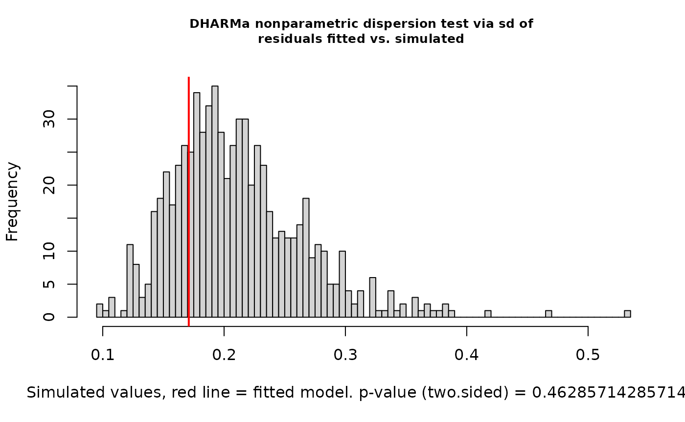

    #> 
    #>  DHARMa nonparametric dispersion test via sd of residuals fitted vs.
    #>  simulated
    #> 
    #> data:  simulationOutput
    #> dispersion = 3.338, p-value < 2.2e-16
    #> alternative hypothesis: two.sided
    testQuantiles(nd_1_mod_dharma)

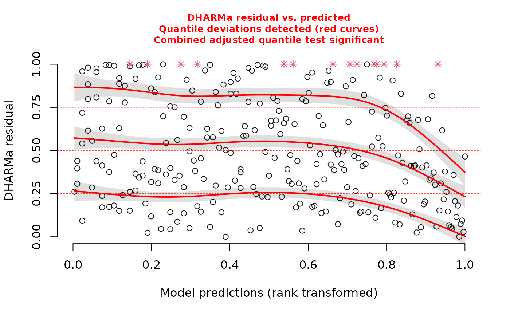

    #> 
    #>  Test for location of quantiles via qgam
    #> 
    #> data:  res
    #> p-value = 5.179e-05
    #> alternative hypothesis: both
    testUniformity(nd_1_mod_dharma)

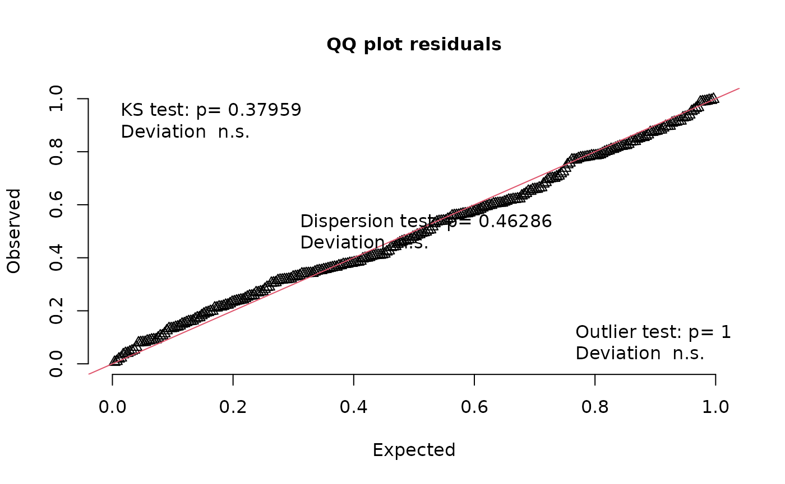

    #> 
    #>  Asymptotic one-sample Kolmogorov-Smirnov test
    #> 
    #> data:  simulationOutput$scaledResiduals
    #> D = 0.080856, p-value = 0.05417
    #> alternative hypothesis: two-sided
    testZeroInflation(nd_1_mod_dharma)

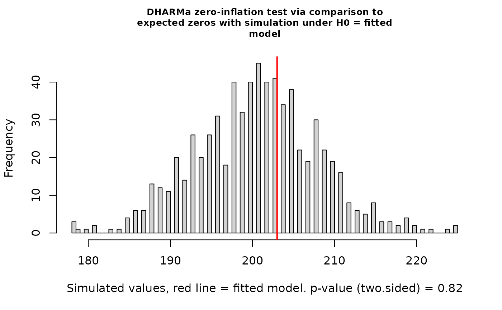

    #> 
    #>  DHARMa zero-inflation test via comparison to expected zeros with
    #>  simulation under H0 = fitted model
    #> 
    #> data:  simulationOutput
    #> ratioObsSim = 0.98334, p-value = 0.6571
    #> alternative hypothesis: two.sided

Yikes! We’ve got overdispersion, quantile deviations, and milder but
still possibly meaningful deviations from uniformity. In simulations,
this happens somewhat often with Fisher’s noncentral hypergeometric
distribution. It’s got excellent theory behind it, but this model
structure can be too rigid. Let’s switch to modeling co-occurrence
probabilities with the binomial distribution by changing the ‘family’
argument.

Build the model and check gofstats:

``` r
nd_1_mod <- buildcompnet(presabs=ex_presabs,
        spvars_dist_int=ex_traits[c("ndtrait")],
        rank=1,
        warmup=300,
        iter=1000,
        family='binomial')
#> 
#> SAMPLING FOR MODEL 'ame_binomial' NOW (CHAIN 1).
#> Chain 1: 
#> Chain 1: Gradient evaluation took 0.000225 seconds
#> Chain 1: 1000 transitions using 10 leapfrog steps per transition would take 2.25 seconds.
#> Chain 1: Adjust your expectations accordingly!
#> Chain 1: 
#> Chain 1: 
#> Chain 1: Iteration:   1 / 1000 [  0%]  (Warmup)
#> Chain 1: Iteration: 100 / 1000 [ 10%]  (Warmup)
#> Chain 1: Iteration: 200 / 1000 [ 20%]  (Warmup)
#> Chain 1: Iteration: 300 / 1000 [ 30%]  (Warmup)
#> Chain 1: Iteration: 301 / 1000 [ 30%]  (Sampling)
#> Chain 1: Iteration: 400 / 1000 [ 40%]  (Sampling)
#> Chain 1: Iteration: 500 / 1000 [ 50%]  (Sampling)
#> Chain 1: Iteration: 600 / 1000 [ 60%]  (Sampling)
#> Chain 1: Iteration: 700 / 1000 [ 70%]  (Sampling)
#> Chain 1: Iteration: 800 / 1000 [ 80%]  (Sampling)
#> Chain 1: Iteration: 900 / 1000 [ 90%]  (Sampling)
#> Chain 1: Iteration: 1000 / 1000 [100%]  (Sampling)
#> Chain 1: 
#> Chain 1:  Elapsed Time: 3.738 seconds (Warm-up)
#> Chain 1:                5.811 seconds (Sampling)
#> Chain 1:                9.549 seconds (Total)
#> Chain 1:
#> Warning: Bulk Effective Samples Size (ESS) is too low, indicating posterior means and medians may be unreliable.
#> Running the chains for more iterations may help. See
#> https://mc-stan.org/misc/warnings.html#bulk-ess
#> [1] "compnet uses Stan under the hood. You may see warnings from Stan alongside, \nthis message. To deal with any warnings Stan might issue, \nPlease see the links provided in Stan's output, as well as the compnet website:\nhttps://kyle-rosenblad.github.io/compnet/"
nd_1_mod_gofstats <- gofstats(nd_1_mod)
#> Approx. completion
#> 25%
#> 50%
#> 75%
#> 100%
nd_1_mod_gofstats
#> p.sd.rowmeans   p.cycle.dep 
#>    0.06666667    0.69000000
```

Check DHARMa diagnostics:

``` r
library(DHARMa)
nd_1_mod_ppred <- postpredsamp(nd_1_mod)
fpr <- apply(nd_1_mod_ppred, 1, mean)
nd_1_mod_dharma <- createDHARMa(simulatedResponse = nd_1_mod_ppred,
                                observedResponse = nd_1_mod$d$both,
                                fittedPredictedResponse = fpr,
                                integerResponse = TRUE)
testDispersion(nd_1_mod_dharma)
```

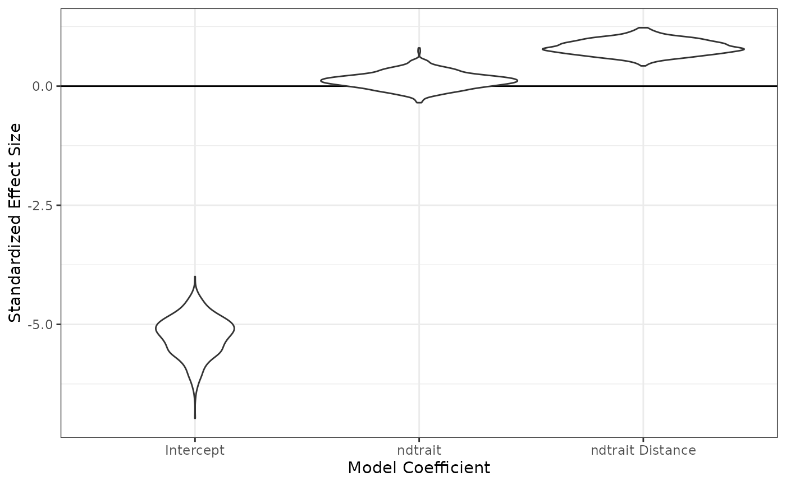

    #> 
    #>  DHARMa nonparametric dispersion test via sd of residuals fitted vs.
    #>  simulated
    #> 
    #> data:  simulationOutput
    #> dispersion = 0.80699, p-value = 0.4857
    #> alternative hypothesis: two.sided
    testQuantiles(nd_1_mod_dharma)


    #> 
    #>  Test for location of quantiles via qgam
    #> 
    #> data:  res
    #> p-value = 0.3432
    #> alternative hypothesis: both
    testUniformity(nd_1_mod_dharma)

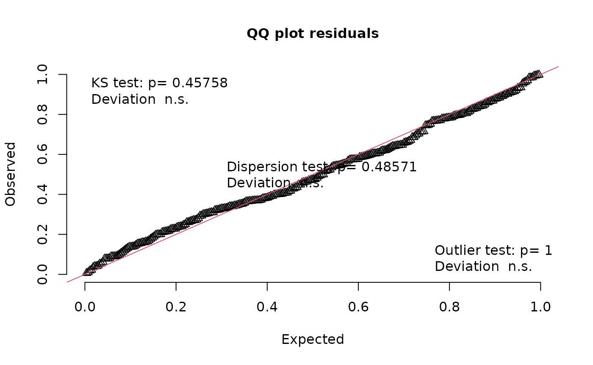

    #> 
    #>  Asymptotic one-sample Kolmogorov-Smirnov test
    #> 
    #> data:  simulationOutput$scaledResiduals
    #> D = 0.051472, p-value = 0.4576
    #> alternative hypothesis: two-sided
    testZeroInflation(nd_1_mod_dharma)

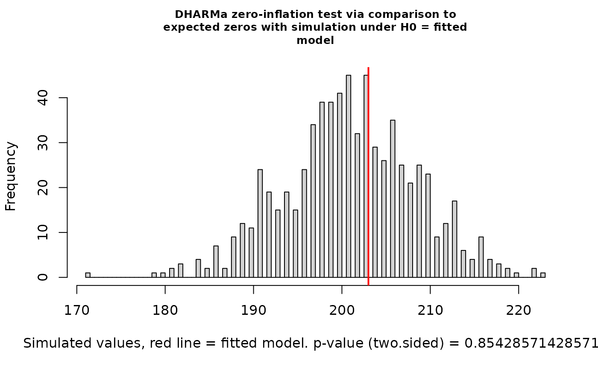

    #> 
    #>  DHARMa zero-inflation test via comparison to expected zeros with
    #>  simulation under H0 = fitted model
    #> 
    #> data:  simulationOutput
    #> ratioObsSim = 1.0093, p-value = 0.8543
    #> alternative hypothesis: two.sided

Looks great! For the rest of this vignette, we’ll stick with the
binomial distribution.

Going forward, to keep this vignette brief, we’ll suppress the plots
that accompany DHARMa tests, but I always recommend checking the plots
when you’re analyzing your own data.

Now let’s explore our results. First we’ll peek at the coefficients for
our predictors of interest:

``` r
summarize_compnet(nd_1_mod)
#>                    Mean       2.5%      97.5%
#> intercept    -5.2693426 -6.1317846 -4.4950307
#> ndtrait_dist  0.8209096  0.5165685  1.1491554
#> ndtrait_sp    0.1154266 -0.2494259  0.4518811
```

Let’s see those as violin plots:

``` r
fixedeff_violins(nd_1_mod)
```


Now we’ll make a scatterplot, in which each point is a species pair. The
x axis will represent the trait value for “Species A” (A vs B is
arbitrary), and the y axis will represent co-occurrence probability.
We’ll include curves for the mean expectation with 95% credible
intervals. There will be multiple curves, each conditioned on a
different value of the focal trait for “Species B”. By default, the
plot_interaction() function will generate the plot by conditioning on
the mean values of all other predictor variables pertaining to other
traits. (In this example model, “ndtrait” is the only trait.)

``` r
plot_interaction(nd_1_mod, xvar="ndtrait", xlabel="ND Trait")
```

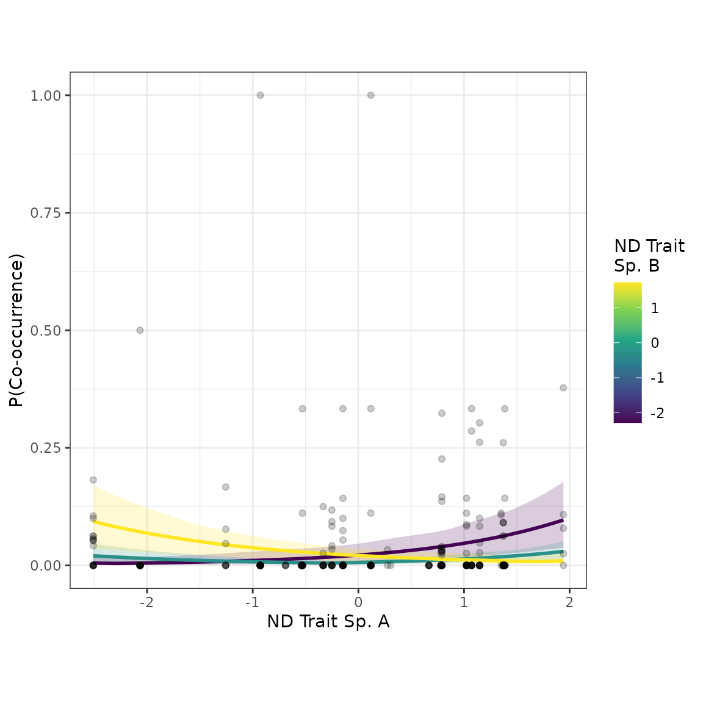

Cool! When Species B has a low value of “ndtrait”, the co-occurrence
probability increases with Species A’s “ndtrait” value. In other words,
if you have a low value of “ndtrait”, you’ll be more likely to co-occur
with other species that have high values. This pattern is consistent
with competitive niche differentiation. Similarly, when Species B’s
“ndtrait” value is high, co-occurrence probability decreases with
Species A’s value. Additionally, when Species B has an intermediate
value of “ndtrait”, co-occurrence probability is higher when Species A’s
value is at either extreme, with a dip in the middle. (This is the
pattern that multiplicative interaction models–as opposed to distance
interaction models–struggle to represent.) Overall, this plot
exemplifies the results we expect for a metacommunity shaped by
competitive niche differentiation.

## Model with two traits

When might we want to use multiple traits in the same model? For one, we
might want to use this strategy to deal with a suspected confounder or
“lurking variable”.

So far, we’ve just been using “ndtrait”, the trait that we think drives
competitive niche differentiation. In general, competitive niche
differentiation is expected to produce heterophily, a pattern whereby
species with different trait values co-occur most often. However, we’ve
got data for another trait called “domtrait”, which we think might
influence competitive ability. In general, competitive hierarchies
produce homophily–i.e., species co-occur most frequently with other
species of similar competitive ability. If there’s an association
between “ndtrait” and “domtrait”, then the homophily caused by
“domtrait” might be masking the heterophily caused by “ndtrait”. (To use
a plant-based example, maybe rooting depth drives niche differentiation,
plant height drives competitive ability, and the two traits are
positively associated.) Let’s see if there’s an association between the
two traits:

``` r
cor(ex_traits[c("ndtrait", "domtrait")])
#>            ndtrait  domtrait
#> ndtrait  1.0000000 0.4400044
#> domtrait 0.4400044 1.0000000
```

There is. What can we do about it? Let’s include “domtrait” as a
covariate. Including a suspected confounder as a covariate can help us
in our quest for an unbiased estimate of the effect of “ndtrait” on
co-occurrence probabilities. (We can never do perfect causal inference
with observational data, but it’s worth getting as close as we can.
That’s another topic.)

Let’s try a new model using both “ndtrait” and “domtrait” with distance
interactions. We’ll start with rank=0. When the model’s built, we’ll run
gofstats() and ‘DHARMa’ checks.

``` r
nd_dom_0_mod <- buildcompnet(presabs=ex_presabs,
                        spvars_dist_int=ex_traits[c("ndtrait", "domtrait")],
                        warmup=400,
                        iter=1200,
                        family='binomial')
#> 
#> SAMPLING FOR MODEL 'srm_binomial' NOW (CHAIN 1).
#> Chain 1: 
#> Chain 1: Gradient evaluation took 8.4e-05 seconds
#> Chain 1: 1000 transitions using 10 leapfrog steps per transition would take 0.84 seconds.
#> Chain 1: Adjust your expectations accordingly!
#> Chain 1: 
#> Chain 1: 
#> Chain 1: Iteration:    1 / 1200 [  0%]  (Warmup)
#> Chain 1: Iteration:  120 / 1200 [ 10%]  (Warmup)
#> Chain 1: Iteration:  240 / 1200 [ 20%]  (Warmup)
#> Chain 1: Iteration:  360 / 1200 [ 30%]  (Warmup)
#> Chain 1: Iteration:  401 / 1200 [ 33%]  (Sampling)
#> Chain 1: Iteration:  520 / 1200 [ 43%]  (Sampling)
#> Chain 1: Iteration:  640 / 1200 [ 53%]  (Sampling)
#> Chain 1: Iteration:  760 / 1200 [ 63%]  (Sampling)
#> Chain 1: Iteration:  880 / 1200 [ 73%]  (Sampling)
#> Chain 1: Iteration: 1000 / 1200 [ 83%]  (Sampling)
#> Chain 1: Iteration: 1120 / 1200 [ 93%]  (Sampling)
#> Chain 1: Iteration: 1200 / 1200 [100%]  (Sampling)
#> Chain 1: 
#> Chain 1:  Elapsed Time: 1.447 seconds (Warm-up)
#> Chain 1:                1.724 seconds (Sampling)
#> Chain 1:                3.171 seconds (Total)
#> Chain 1: 
#> [1] "compnet uses Stan under the hood. You may see warnings from Stan alongside, \nthis message. To deal with any warnings Stan might issue, \nPlease see the links provided in Stan's output, as well as the compnet website:\nhttps://kyle-rosenblad.github.io/compnet/"

nd_dom_0_mod_gofstats <- gofstats(nd_dom_0_mod)
#> Approx. completion
#> 25%
#> 50%
#> 75%
#> 100%
nd_dom_0_mod_gofstats
#> p.sd.rowmeans   p.cycle.dep 
#>    0.08333333    0.88666667

nd_dom_0_mod_ppred <- postpredsamp(nd_dom_0_mod)
fpr <- apply(nd_dom_0_mod_ppred, 1, mean)
nd_dom_0_mod_dharma <- createDHARMa(simulatedResponse = nd_dom_0_mod_ppred,
                                observedResponse = nd_dom_0_mod$d$both,
                                fittedPredictedResponse = fpr,
                                integerResponse = TRUE)
testDispersion(nd_dom_0_mod_dharma, plot=FALSE)
#> 
#>  DHARMa nonparametric dispersion test via sd of residuals fitted vs.
#>  simulated
#> 
#> data:  simulationOutput
#> dispersion = 1.8247, p-value = 0.01
#> alternative hypothesis: two.sided
testQuantiles(nd_dom_0_mod_dharma, plot=FALSE)
#> Warning in newton(lsp = lsp, X = G$X, y = G$y, Eb = G$Eb, UrS = G$UrS, L = G$L,
#> : Fitting terminated with step failure - check results carefully
#> 
#>  Test for location of quantiles via qgam
#> 
#> data:  nd_dom_0_mod_dharma
#> p-value = 0.7274
#> alternative hypothesis: both
testUniformity(nd_dom_0_mod_dharma, plot=FALSE)
#> 
#>  Asymptotic one-sample Kolmogorov-Smirnov test
#> 
#> data:  simulationOutput$scaledResiduals
#> D = 0.046043, p-value = 0.6021
#> alternative hypothesis: two-sided
testZeroInflation(nd_dom_0_mod_dharma, plot=FALSE)
#> 
#>  DHARMa zero-inflation test via comparison to expected zeros with
#>  simulation under H0 = fitted model
#> 
#> data:  simulationOutput
#> ratioObsSim = 1.0164, p-value = 0.735
#> alternative hypothesis: two.sided
```

We’ve got a borderline issue with high-order non-independence and a
clear issue with overdispersion. Let’s try ‘rank’=1 next. You’ll notice
I increased ‘adapt_delta’ closer to 1 to avoid divergent transitions,
which is one kind of problem the HMC sampler can run into.

``` r
nd_dom_1_mod <- buildcompnet(presabs=ex_presabs,
                        spvars_dist_int=ex_traits[c("ndtrait", "domtrait")],
                        rank = 1,
                        warmup=1000,
                        iter=2000,
                        adapt_delta=0.95,
                        family='binomial')
#> 
#> SAMPLING FOR MODEL 'ame_binomial' NOW (CHAIN 1).
#> Chain 1: 
#> Chain 1: Gradient evaluation took 0.000158 seconds
#> Chain 1: 1000 transitions using 10 leapfrog steps per transition would take 1.58 seconds.
#> Chain 1: Adjust your expectations accordingly!
#> Chain 1: 
#> Chain 1: 
#> Chain 1: Iteration:    1 / 2000 [  0%]  (Warmup)
#> Chain 1: Iteration:  200 / 2000 [ 10%]  (Warmup)
#> Chain 1: Iteration:  400 / 2000 [ 20%]  (Warmup)
#> Chain 1: Iteration:  600 / 2000 [ 30%]  (Warmup)
#> Chain 1: Iteration:  800 / 2000 [ 40%]  (Warmup)
#> Chain 1: Iteration: 1000 / 2000 [ 50%]  (Warmup)
#> Chain 1: Iteration: 1001 / 2000 [ 50%]  (Sampling)
#> Chain 1: Iteration: 1200 / 2000 [ 60%]  (Sampling)
#> Chain 1: Iteration: 1400 / 2000 [ 70%]  (Sampling)
#> Chain 1: Iteration: 1600 / 2000 [ 80%]  (Sampling)
#> Chain 1: Iteration: 1800 / 2000 [ 90%]  (Sampling)
#> Chain 1: Iteration: 2000 / 2000 [100%]  (Sampling)
#> Chain 1: 
#> Chain 1:  Elapsed Time: 11.229 seconds (Warm-up)
#> Chain 1:                8.846 seconds (Sampling)
#> Chain 1:                20.075 seconds (Total)
#> Chain 1: 
#> [1] "compnet uses Stan under the hood. You may see warnings from Stan alongside, \nthis message. To deal with any warnings Stan might issue, \nPlease see the links provided in Stan's output, as well as the compnet website:\nhttps://kyle-rosenblad.github.io/compnet/"

nd_dom_1_mod_gofstats <- gofstats(nd_dom_1_mod)
#> Approx. completion
#> 25%
#> 50%
#> 75%
#> 100%
nd_dom_1_mod_gofstats
#> p.sd.rowmeans   p.cycle.dep 
#>    0.09666667    0.71333333

nd_dom_1_mod_ppred <- compnet::postpredsamp(nd_dom_1_mod)
fpr <- apply(nd_dom_1_mod_ppred, 1, mean)
nd_dom_1_mod_dharma <- createDHARMa(simulatedResponse = nd_dom_1_mod_ppred,
                                observedResponse = nd_dom_1_mod$d$both,
                                fittedPredictedResponse = fpr,
                                integerResponse = TRUE)
testDispersion(nd_dom_1_mod_dharma, plot=FALSE)
#> 
#>  DHARMa nonparametric dispersion test via sd of residuals fitted vs.
#>  simulated
#> 
#> data:  simulationOutput
#> dispersion = 0.83647, p-value = 0.576
#> alternative hypothesis: two.sided
testQuantiles(nd_dom_1_mod_dharma, plot=FALSE)
#> 
#>  Test for location of quantiles via qgam
#> 
#> data:  nd_dom_1_mod_dharma
#> p-value = 0.7235
#> alternative hypothesis: both
testUniformity(nd_dom_1_mod_dharma, plot=FALSE)
#> 
#>  Asymptotic one-sample Kolmogorov-Smirnov test
#> 
#> data:  simulationOutput$scaledResiduals
#> D = 0.04712, p-value = 0.5723
#> alternative hypothesis: two-sided
testZeroInflation(nd_dom_1_mod_dharma, plot=FALSE)
#> 
#>  DHARMa zero-inflation test via comparison to expected zeros with
#>  simulation under H0 = fitted model
#> 
#> data:  simulationOutput
#> ratioObsSim = 1.0022, p-value = 1
#> alternative hypothesis: two.sided
```

We’ve solved the overdispersion problem. The residuals still show a
borderline case of higher-order non-independence. For now we’ll leave it
here, but if you’d like, you can try increasing ‘rank’ to 2 or above as
an exercise.

Let’s have a quick look at our latest results and compare to the model
with no covariate adjustment:

``` r
summarize_compnet(nd_1_mod)
#>                    Mean       2.5%      97.5%
#> intercept    -5.2693426 -6.1317846 -4.4950307
#> ndtrait_dist  0.8209096  0.5165685  1.1491554
#> ndtrait_sp    0.1154266 -0.2494259  0.4518811
summarize_compnet(nd_dom_1_mod)
#>                      Mean        2.5%      97.5%
#> intercept     -4.33821310 -5.17593835 -3.6462052
#> ndtrait_dist   1.05540241  0.73867257  1.3930362
#> domtrait_dist -1.10206765 -1.46988324 -0.7477511
#> ndtrait_sp    -0.08069789 -0.43684632  0.2482575
#> domtrait_sp    0.24720582 -0.09260641  0.5740226
```

The coefficient of the “ndtrait” distance term is greater in the new
model. This suggests our covariate adjustment strategy helped to
“unmask” the true effect of “ndtrait” on co-occurrence probability.
Let’s see if the scatterplots look noticeably different:

``` r
plot_interaction(nd_1_mod, xvar="ndtrait", xlabel="ND Trait")
```


``` r
plot_interaction(nd_dom_1_mod, xvar="ndtrait", xlabel="ND Trait")
```

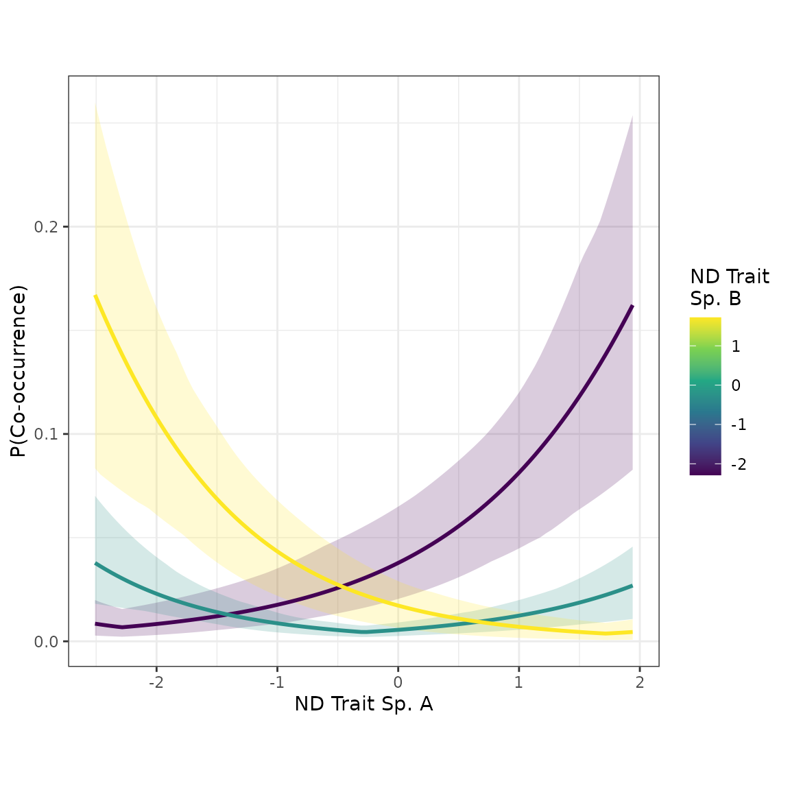

The effect of species’ pairwise distances in “ndtrait” is noticeably
stronger in the new model, which adjusted for the potential confounder,
“domtrait”.

## Categorical trait model

Now let’s try a model with a categorical predictor, “ctrait”. We’ll use
rank 0, and we’ll skip the gofstats and DHARMa checks to keep things
brief.

``` r
c_0_mod <- buildcompnet(presabs=ex_presabs,
                        spvars_cat_int=ex_traits[c("ctrait")],
                        rank=0,
                        family='binomial')
#> 
#> SAMPLING FOR MODEL 'srm_binomial' NOW (CHAIN 1).
#> Chain 1: 
#> Chain 1: Gradient evaluation took 8.3e-05 seconds
#> Chain 1: 1000 transitions using 10 leapfrog steps per transition would take 0.83 seconds.
#> Chain 1: Adjust your expectations accordingly!
#> Chain 1: 
#> Chain 1: 
#> Chain 1: Iteration:    1 / 2000 [  0%]  (Warmup)
#> Chain 1: Iteration:  200 / 2000 [ 10%]  (Warmup)
#> Chain 1: Iteration:  400 / 2000 [ 20%]  (Warmup)
#> Chain 1: Iteration:  600 / 2000 [ 30%]  (Warmup)
#> Chain 1: Iteration:  800 / 2000 [ 40%]  (Warmup)
#> Chain 1: Iteration: 1000 / 2000 [ 50%]  (Warmup)
#> Chain 1: Iteration: 1001 / 2000 [ 50%]  (Sampling)
#> Chain 1: Iteration: 1200 / 2000 [ 60%]  (Sampling)
#> Chain 1: Iteration: 1400 / 2000 [ 70%]  (Sampling)
#> Chain 1: Iteration: 1600 / 2000 [ 80%]  (Sampling)
#> Chain 1: Iteration: 1800 / 2000 [ 90%]  (Sampling)
#> Chain 1: Iteration: 2000 / 2000 [100%]  (Sampling)
#> Chain 1: 
#> Chain 1:  Elapsed Time: 3.778 seconds (Warm-up)
#> Chain 1:                3.265 seconds (Sampling)
#> Chain 1:                7.043 seconds (Total)
#> Chain 1: 
#> [1] "compnet uses Stan under the hood. You may see warnings from Stan alongside, \nthis message. To deal with any warnings Stan might issue, \nPlease see the links provided in Stan's output, as well as the compnet website:\nhttps://kyle-rosenblad.github.io/compnet/"
```

Now let’s break down the output summary:

``` r
summarize_compnet(c_0_mod)
#>                         Mean       2.5%      97.5%
#> intercept         -4.6020236 -6.1073724 -3.3346624
#> ctrait_int        -0.5992574 -0.9781232 -0.2223392
#> ctrait_b_dummy_sp  0.1370630 -0.8875360  1.1652170
#> ctrait_c_dummy_sp  0.4231797 -0.6237055  1.6372105
```

After the intercept, we see the results for the interaction term. This
is a binary indicator that equals 1 when a species pair has the same
value of the categorical trait and equals 0 when they have different
values. We have strong evidence that the coefficient is negative, which
suggests having the same value of “ctrait” makes co-occurrence less
likely. This is the pattern we expect from competitive niche
differentiation.

The “dummy” rows are coefficients corresponding to species-level effects
for each category of “ctrait”. The first category, “a”, doesn’t get a
coefficient because it is automatically designated the “reference
category”. The effects for “b” and “c” can be viewed as contrasts
relative to the reference category.

## Phylogenetic distance model

Sometimes we might not have trait data, or we might not be sure which
traits make sense to use in our models. If we think phylogenetic
distance serves as a reasonable proxy for resource use overlap, then we
could use phylogenetic distance is a predictor in our ‘compnet’ model.
Let’s try this approach with the example data set.

First, we’ll load the phylogenetic distance data and have a look.

``` r
data("ex_phylo")
head(ex_phylo)
#>   spAid spBid phylodist
#> 1   sp1   sp2  1.486439
#> 2   sp1   sp3  3.160156
#> 3   sp1   sp4  3.160968
#> 4   sp1   sp5  2.671681
#> 5   sp1   sp6  2.302756
#> 6   sp1   sp7  3.061021
```

Rows represent species pairs. In addition to the phylodist column, there
are two columns containing unique species names for each pair. These
names must match the names in our presence-absence matrix.

Let’s build the model now. Phylogenetic distance is a species-pair-level
variable (not a species-level variable), so we’ll tell buildcompnet() we
want to use ‘ex_phylo’ with the ‘pairvars’ argument. We’ll start with
rank 0.

``` r
phylo_0_mod <- buildcompnet(presabs=ex_presabs,
                            pairvars=ex_phylo,
                            family='binomial')
#> 
#> SAMPLING FOR MODEL 'srm_binomial' NOW (CHAIN 1).
#> Chain 1: 
#> Chain 1: Gradient evaluation took 8.1e-05 seconds
#> Chain 1: 1000 transitions using 10 leapfrog steps per transition would take 0.81 seconds.
#> Chain 1: Adjust your expectations accordingly!
#> Chain 1: 
#> Chain 1: 
#> Chain 1: Iteration:    1 / 2000 [  0%]  (Warmup)
#> Chain 1: Iteration:  200 / 2000 [ 10%]  (Warmup)
#> Chain 1: Iteration:  400 / 2000 [ 20%]  (Warmup)
#> Chain 1: Iteration:  600 / 2000 [ 30%]  (Warmup)
#> Chain 1: Iteration:  800 / 2000 [ 40%]  (Warmup)
#> Chain 1: Iteration: 1000 / 2000 [ 50%]  (Warmup)
#> Chain 1: Iteration: 1001 / 2000 [ 50%]  (Sampling)
#> Chain 1: Iteration: 1200 / 2000 [ 60%]  (Sampling)
#> Chain 1: Iteration: 1400 / 2000 [ 70%]  (Sampling)
#> Chain 1: Iteration: 1600 / 2000 [ 80%]  (Sampling)
#> Chain 1: Iteration: 1800 / 2000 [ 90%]  (Sampling)
#> Chain 1: Iteration: 2000 / 2000 [100%]  (Sampling)
#> Chain 1: 
#> Chain 1:  Elapsed Time: 2.145 seconds (Warm-up)
#> Chain 1:                2.169 seconds (Sampling)
#> Chain 1:                4.314 seconds (Total)
#> Chain 1: 
#> [1] "compnet uses Stan under the hood. You may see warnings from Stan alongside, \nthis message. To deal with any warnings Stan might issue, \nPlease see the links provided in Stan's output, as well as the compnet website:\nhttps://kyle-rosenblad.github.io/compnet/"
```

Run our model checks:

``` r
gofstats(phylo_0_mod)
#> Approx. completion
#> 25%
#> 50%
#> 75%
#> 100%
#> p.sd.rowmeans   p.cycle.dep 
#>    0.02666667    0.16000000

phylo_0_mod_ppred <- postpredsamp(phylo_0_mod)
fpr <- apply(phylo_0_mod_ppred, 1, mean)
phylo_0_mod_dharma <- createDHARMa(simulatedResponse = phylo_0_mod_ppred,
                                observedResponse = phylo_0_mod$d$both,
                                fittedPredictedResponse = fpr,
                                integerResponse = TRUE)
testDispersion(phylo_0_mod_dharma, plot=FALSE)
#> 
#>  DHARMa nonparametric dispersion test via sd of residuals fitted vs.
#>  simulated
#> 
#> data:  simulationOutput
#> dispersion = 2.0576, p-value = 0.002
#> alternative hypothesis: two.sided
testQuantiles(phylo_0_mod_dharma, plot=FALSE)
#> 
#>  Test for location of quantiles via qgam
#> 
#> data:  phylo_0_mod_dharma
#> p-value = 7.073e-06
#> alternative hypothesis: both
testUniformity(phylo_0_mod_dharma, plot=FALSE)
#> 
#>  Asymptotic one-sample Kolmogorov-Smirnov test
#> 
#> data:  simulationOutput$scaledResiduals
#> D = 0.050272, p-value = 0.4881
#> alternative hypothesis: two-sided
testZeroInflation(phylo_0_mod_dharma, plot=FALSE)
#> 
#>  DHARMa zero-inflation test via comparison to expected zeros with
#>  simulation under H0 = fitted model
#> 
#> data:  simulationOutput
#> ratioObsSim = 1.0393, p-value = 0.31
#> alternative hypothesis: two.sided
```

We’ve got problems with overdispersion and quantile deviations. Let’s
try again with ‘rank’ = 1.

``` r
phylo_1_mod <- buildcompnet(presabs=ex_presabs,
                            pairvars=ex_phylo,
                            rank=1,
                            adapt_delta=0.9,
                            family='binomial')
#> 
#> SAMPLING FOR MODEL 'ame_binomial' NOW (CHAIN 1).
#> Chain 1: 
#> Chain 1: Gradient evaluation took 0.000154 seconds
#> Chain 1: 1000 transitions using 10 leapfrog steps per transition would take 1.54 seconds.
#> Chain 1: Adjust your expectations accordingly!
#> Chain 1: 
#> Chain 1: 
#> Chain 1: Iteration:    1 / 2000 [  0%]  (Warmup)
#> Chain 1: Iteration:  200 / 2000 [ 10%]  (Warmup)
#> Chain 1: Iteration:  400 / 2000 [ 20%]  (Warmup)
#> Chain 1: Iteration:  600 / 2000 [ 30%]  (Warmup)
#> Chain 1: Iteration:  800 / 2000 [ 40%]  (Warmup)
#> Chain 1: Iteration: 1000 / 2000 [ 50%]  (Warmup)
#> Chain 1: Iteration: 1001 / 2000 [ 50%]  (Sampling)
#> Chain 1: Iteration: 1200 / 2000 [ 60%]  (Sampling)
#> Chain 1: Iteration: 1400 / 2000 [ 70%]  (Sampling)
#> Chain 1: Iteration: 1600 / 2000 [ 80%]  (Sampling)
#> Chain 1: Iteration: 1800 / 2000 [ 90%]  (Sampling)
#> Chain 1: Iteration: 2000 / 2000 [100%]  (Sampling)
#> Chain 1: 
#> Chain 1:  Elapsed Time: 8.762 seconds (Warm-up)
#> Chain 1:                9.293 seconds (Sampling)
#> Chain 1:                18.055 seconds (Total)
#> Chain 1:
#> Warning: The largest R-hat is 1.07, indicating chains have not mixed.
#> Running the chains for more iterations may help. See
#> https://mc-stan.org/misc/warnings.html#r-hat
#> Warning: Bulk Effective Samples Size (ESS) is too low, indicating posterior means and medians may be unreliable.
#> Running the chains for more iterations may help. See
#> https://mc-stan.org/misc/warnings.html#bulk-ess
#> [1] "compnet uses Stan under the hood. You may see warnings from Stan alongside, \nthis message. To deal with any warnings Stan might issue, \nPlease see the links provided in Stan's output, as well as the compnet website:\nhttps://kyle-rosenblad.github.io/compnet/"
```

Run our model checks:

``` r
gofstats(phylo_1_mod)
#> Approx. completion
#> 25%
#> 50%
#> 75%
#> 100%
#> p.sd.rowmeans   p.cycle.dep 
#>     0.1000000     0.5366667

phylo_1_mod_ppred <- postpredsamp(phylo_1_mod)
fpr <- apply(phylo_1_mod_ppred, 1, mean)
phylo_1_mod_dharma <- createDHARMa(simulatedResponse = phylo_1_mod_ppred,
                                observedResponse = phylo_1_mod$d$both,
                                fittedPredictedResponse = fpr,
                                integerResponse = TRUE)
testDispersion(phylo_1_mod_dharma, plot=FALSE)
#> 
#>  DHARMa nonparametric dispersion test via sd of residuals fitted vs.
#>  simulated
#> 
#> data:  simulationOutput
#> dispersion = 0.98263, p-value = 0.928
#> alternative hypothesis: two.sided
testQuantiles(phylo_1_mod_dharma, plot=FALSE)
#> 
#>  Test for location of quantiles via qgam
#> 
#> data:  phylo_1_mod_dharma
#> p-value = 0.5461
#> alternative hypothesis: both
testUniformity(phylo_1_mod_dharma, plot=FALSE)
#> 
#>  Asymptotic one-sample Kolmogorov-Smirnov test
#> 
#> data:  simulationOutput$scaledResiduals
#> D = 0.060261, p-value = 0.2688
#> alternative hypothesis: two-sided
testZeroInflation(phylo_1_mod_dharma, plot=FALSE)
#> 
#>  DHARMa zero-inflation test via comparison to expected zeros with
#>  simulation under H0 = fitted model
#> 
#> data:  simulationOutput
#> ratioObsSim = 1.0252, p-value = 0.564
#> alternative hypothesis: two.sided
```

Looks good! Let’s visualize results:

``` r
fixedeff_violins(phylo_1_mod)
```

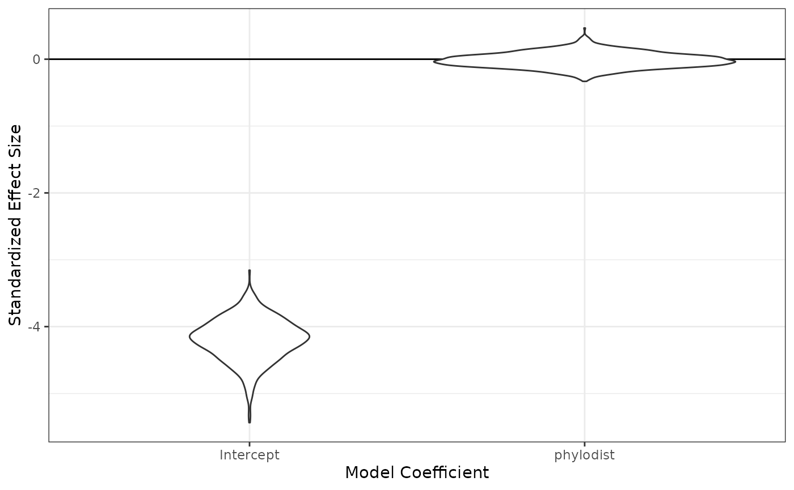

``` r
plot_pairvar(phylo_1_mod, xvar="phylodist", xlabel="Phylogenetic Distance")
```

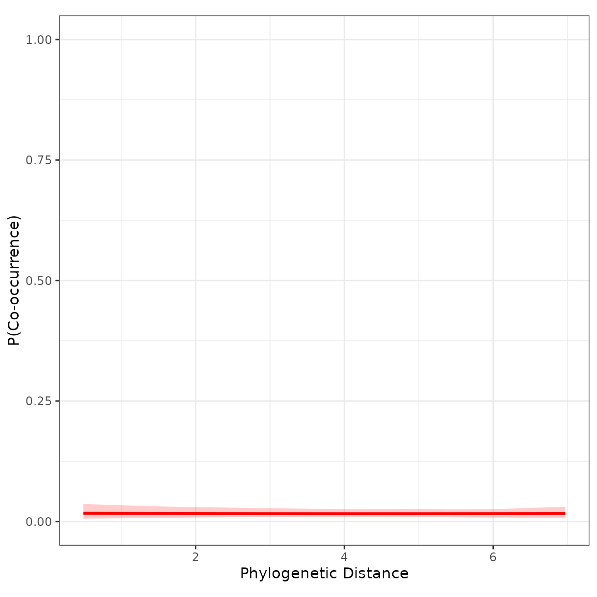

Not much of an effect. We can regard this as a warning that phylogenetic
distance may not always be an ideal proxy for resource use overlap or
habitat niche similarity.
